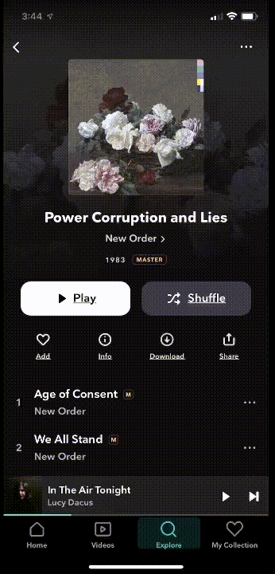

# tidal-discord



Discord bot to download music using [tidal-dl](https://github.com/yaronzz/Tidal-Media-Downloader) and import to an existing [beets](https://github.com/beetbox/beets)
library.

** this project assumes you have an already-existing beets library**

To use:

```bash
git clone https://github.com/dcalacci/tidal-discord && cd tidal-discord
docker build -t dcalacci/tidal-discord .
docker run --env-file docker.env -v /media/nfs/music/@library:/music -v /media/nfs/music/import/discord:/downloads dcalacci/tidal-discord:latest
```

Volumes, explained:

- `/music` in the container should point to your current beets music library directory
- `/downloads` should point to wherever you want `tidal-dl` to download files from tidal, before
  they're imported into your beets library.

To run the container, you need to set a few env vars. These are dependent on how you mount your
volumes. For example, if you mount your beets library directory at `/data/music` in the container,
you should set `BEETS_LIBRARY_DIR=/data/music`.

Save the following as `docker.env`:

```
# discord client token for your bot app
DISCORD_CLIENT_TOKEN=mydiscordbottoken
# keep this as defined here - this is the path (in container) to the tidal-dl binary after install
TIDAL_DL_PATH=/usr/local/bin/tidal-dl
# keep this as defined - this is the temporary download directory for tidal
TIDAL_OUTPUT_PATH=/downloads
# path (in container) to your beets config file.
BEETS_CONFIG_FILE=/app/config/config.yaml
# path (in container) to your beets music library
BEETS_LIBRARY_DIR=/music
# path (in container) to your beets music library database file
BEETS_LIBRARY_FILE=/music/library.db
```

## Beets and tidal configuration

Config files for beets and tidal live in the `config` directory. I've included an example beets
config, but you should make sure you replace it with your own.
